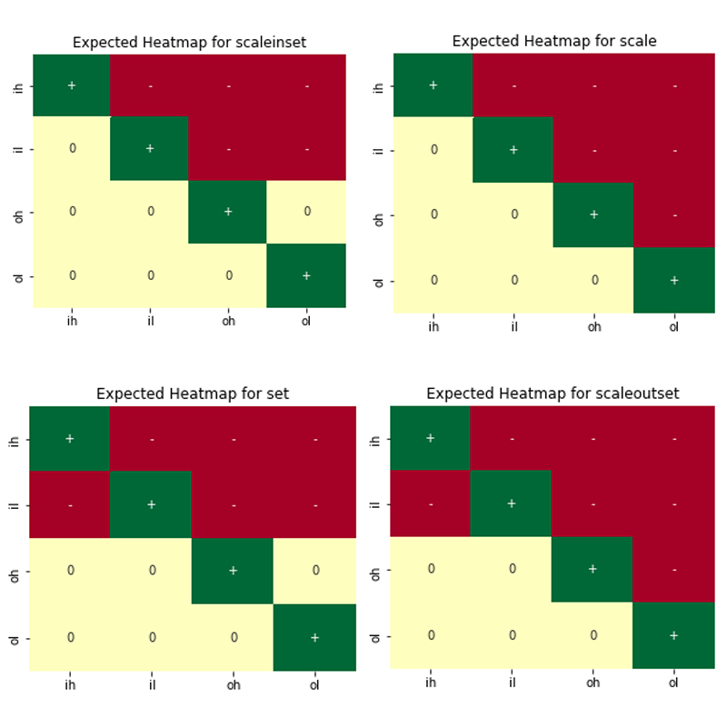
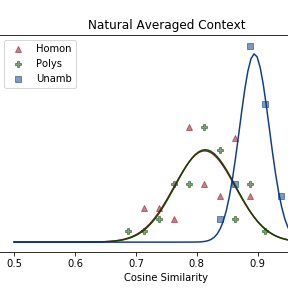
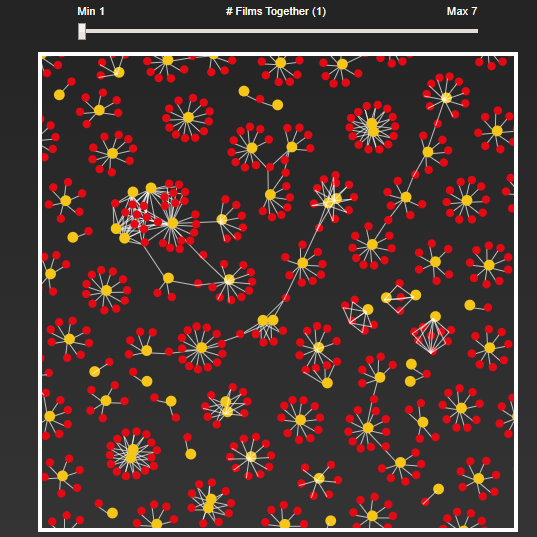

# Daniel Smits' Projects
An assortment of projects in web development and machine learning.

<table border="0" background="none" style="background: none;">
 <tr>
   <td>
     <b style="font-size:30px"><a href="instadan/">InstaDan: Visual and Functional Instagram Clone </a></b>
      
     Description of InstaDan
     
     
  </td>
    <td>
     <b style="font-size:30px"><a href="rsa_alternatives/">What's the Alternative? Counterfactual Reasoning</a></b>
      
     Description of RSA
      
     
  </td>
 </tr>
  <tr>
    <td>
     <b style="font-size:30px"><a href="ambiguity_rep/">Contextualized Ambiguity Representation</a></b>
      
     Description Ambiguity
      
     
   </td>
    <td>
     <b style="font-size:30px"><a href="netflix_viz/">Interactive Netflix Data Visualizations</a></b>
      
     Description Netflix
      
     
   </td>
 </tr>
 
</table>
