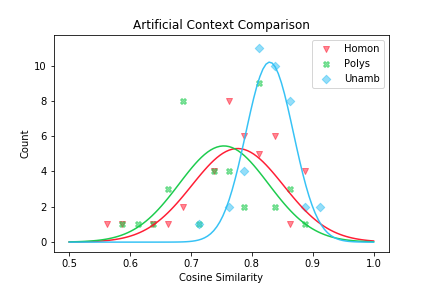
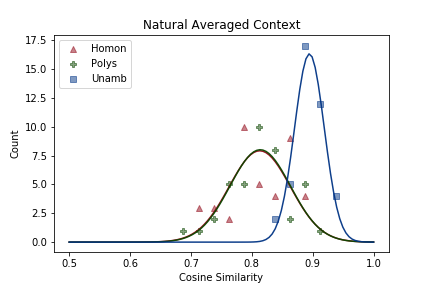

# Ambiguity within Ambiguity: ELMo and the Homonymy-Polysemy Distinction

A. Izumi, D. Smits, M. Mines

Advised by R. Feiman and E. Pavlick at Brown University

Completed for CSCI 29521

In this project, we investigated the representation of ambiguous nouns in ELMo (Peters et al. 2018) a deep contextualized language model. In particular, we investigated the relative impact of sense versus context, with a focus on whether ELMo represented the putative distinction between homonymy and polysemy. To investigate this, we compared unambiguous, homonymous, and polysemous words across various natural and artificial contexts. We found that ELMo's embeddings were highly determined by sense rather than just context, but did not have any relative difference between homonymy and polysemy, as can be seen in the figures below. Our full report can be found [here](Homonymy%20Polysemy%20Distinction.pdf).

For more information on ELMo, I suggest reading the [original ELMo paper](https://arxiv.org/abs/1802.05365) and this [Illustrated Guide](http://jalammar.github.io/illustrated-bert/).
